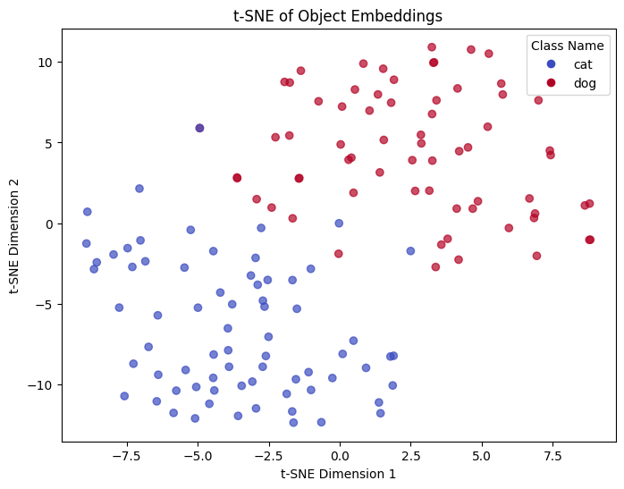
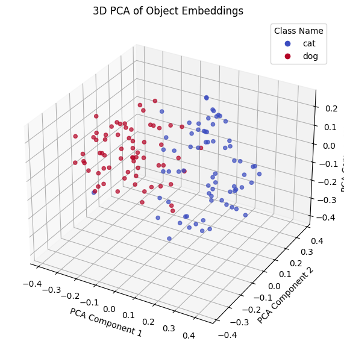

<div align="center">

# **Object Embedding System**

</div>

## **Overview**
This project implements an **Object Embedding System** that detects objects in an image, extracts their bounding boxes, and generates embeddings for each detected object. The embeddings allow **clustering, retrieval, and comparison of similar objects**.

## **Features**
- **Object Detection**: Uses **YOLOv12x** to detect objects in an image.
  * YOLOv12x used for minimal false positives - it can be replaced with other YOLO models.
- **Object Embedding Extraction**:
  - **Cropping with ResNet50 (Main Algorithm)** – Extracts high-quality embeddings.
  - **CLIP Encoder (Alternative Option)** – Can be used instead of ResNet50 for embeddings.
  - **ROI Align (Tested but Not Effective)** – Implemented but found to produce lower-quality embeddings.
- **Visualization**:
  - **t-SNE (2D)** – Projects embeddings into 2D space for better **local structure evaluation**.
  - **PCA (3D)** – Projects embeddings into 3D space for **global structure analysis**.

---

## **📁 Project Structure**
```
├── cat_dogs_images/           # Sample images for object embedding evaluation
├── ObjectEmbedding.ipynb      # Main implementation & evaluation notebook
├── requirements.txt           # Python dependencies for this project
├── README.md                  # Project documentation
└── results/                   # Contains visualization outputs
```

---

## **🚀 Installation & Setup**
The project was tested on **Google Colab with a T4 GPU** but should work on **any CUDA-compatible GPU**.
Make sure you have Python 3.11.11+ installed.

### **1️⃣ Clone the Repository**
```bash
git clone https://github.com/roye52371/Object-Embedding-System.git
cd Object-Embedding-System
```

### **2️⃣ Install Dependencies**
#### **Using Pip**:
```bash
pip install -r requirements.txt
```

💡 **Google Colab users** can skip installation, as dependencies will be installed automatically.

---

## **🔍 Object Embedding Methods Used**
The project explores multiple approaches for extracting embeddings from detected objects:

### **📌 1. Cropping + ResNet50 (Main Algorithm)** 
- **Approach:** After detecting objects using YOLO, the detected bounding boxes are used to crop objects from the original image. The cropped images are then passed through a **ResNet50** backbone to extract feature embeddings.
- **Why?** This method provides high-quality embeddings, as the cropped objects maintain spatial integrity and pass through a **well-trained CNN classifier**.

### **📌 2. Cropping + CLIP Encoder (Alternative Approach)** 
- **Approach:** Similar to the ResNet50 approach, but instead of using ResNet50, the **CLIP ViT-B/32** Encoder is used for extracting embeddings.
- **Why?** **CLIP** provides embeddings that are aligned with **both images and text**, which could lead to a better embeddings.

### **📌 3. ROI Align + ResNet50 (Tested but Not Effective)** 
- **Approach:** Instead of cropping objects, **ROI Align** extracts region-wise feature maps (of the objects) directly from the feature map of image which is genereted by **ResNet50**’ backbone.
- **Why?** Theoretically, this method retains **contextual information** from the entire image rather than isolated objects and could be more efficient then croping objects.

---

### **🔍 Evaluation Metrics**
- **t-SNE (2D)** is used to evaluate local structure and how well embeddings of similar objects cluster.
- **PCA (3D)** is used to analyze global structure and class separability.

---

## **🔬 Usage**
### **Running the Object Embedder**
```python
from object_embedder import ObjectEmbedder

detector = "yolo12x" # Can be replaced with other YOLO models
embed_method = "crop"  # Can be "roi_align" (not recommended)
crop_backbone = "resnet50"  # Can be "clip" as an alternative
conf_threshold = 0.6  # Confidence threshold for detection

embedder = ObjectEmbedder(
    detection_model=detector,
    embed_method=embed_method,
    crop_backbone=crop_backbone,
    conf_threshold=conf_threshold,
    target_classes=["dog", "cat"]
)
```

### **Running Evaluation on a Folder of Images**
```python
evaluate_data("path/to/your/image/folder", embedder)
```
For a **full pipeline demonstration**, open and run **`ObjectEmbedding.ipynb`**.

---

## **📊 Expected Output**
- ✅ **Bounding Boxes** – Objects detected with confidence scores.
- ✅ **Feature Embeddings** – Each detected object is converted into a **numerical feature vector**.
- ✅ **Visualizations**:
  - **t-SNE 2D Plot** – Clusters objects (e.g., grouping dogs and cats).
  - **PCA 3D Plot** – Shows **global class separation**.

### **Example Log Output (from my crop+ResNet50 algorithm)**:
```
Processed 138 embeddings after filtering.
Processed 35 images.
Average processing time per image: 114.92 ms
```

---

## **📈 Expected Results (from my crop+ResNet50 algorithm)**
### **t-SNE Visualization of Embeddings**


### **PCA 3D Visualization of Embeddings**


---

## Notes on ROI Align
Although **ROI Align** was implemented as an alternative embedding method, results were not satisfactory. The method is still available in the code for reference but is not recommended as the primary approach.

---


## **📞 Contact**
For questions, **open an issue** on this repository or email **roye.katzav@gmail.com**.


